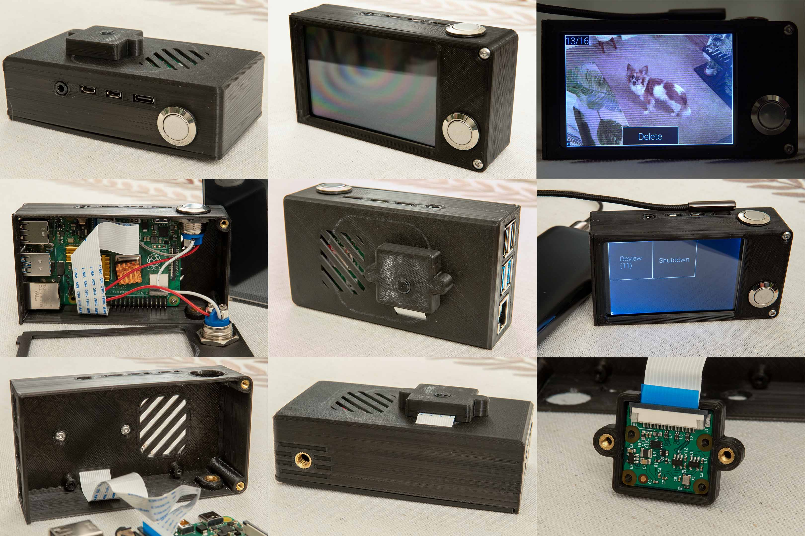
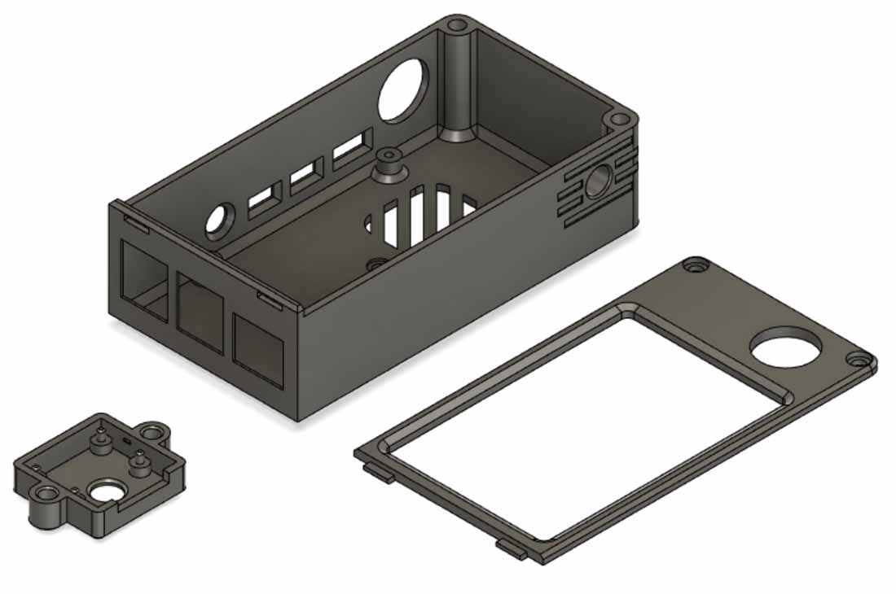

# Pi & Shoot

<a href="extras/camera_views.jpg"></a>
<a href="extras/model_screen.jpg"></a>

## Building

See `extras` folder for models and part information. Please be aware that this model has tolerances for my printer baked in. I printed with supports on >80 degree overhangs mainly to prevent sagging on the rectangular port holes. It was printed with a 0.6mm nozzle at 0.2mm layer height on an Ender 3.

## Wiring

The two buttons connect board pins 38 (front button) and 40 (top button) to ground. The script uses the Pi's internal pullup resistors.

## Setup

Install `ffmpeg`. Uses ffmpeg to convert png to whatever the framebuffer format is. fbi does not like being called over and over.

Screen is constantly calibrating, just touch all four corners the first time your run before using the menu.

Add user to gpio group, replace `user` with your username to use GPIO without running script as root

```
sudo adduser user gpio
```

Add line to visudo, replace `user` with your username to shutdown without running script as root

```
user ALL=(ALL) NOPASSWD: /sbin/poweroff, /sbin/reboot, /sbin/shutdown
```

I use systemctl to run the camera.py script at startup